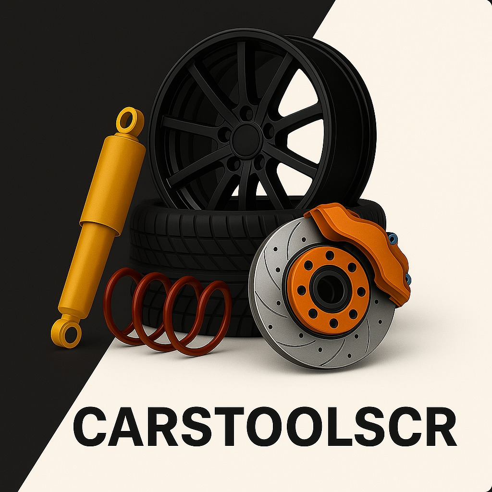
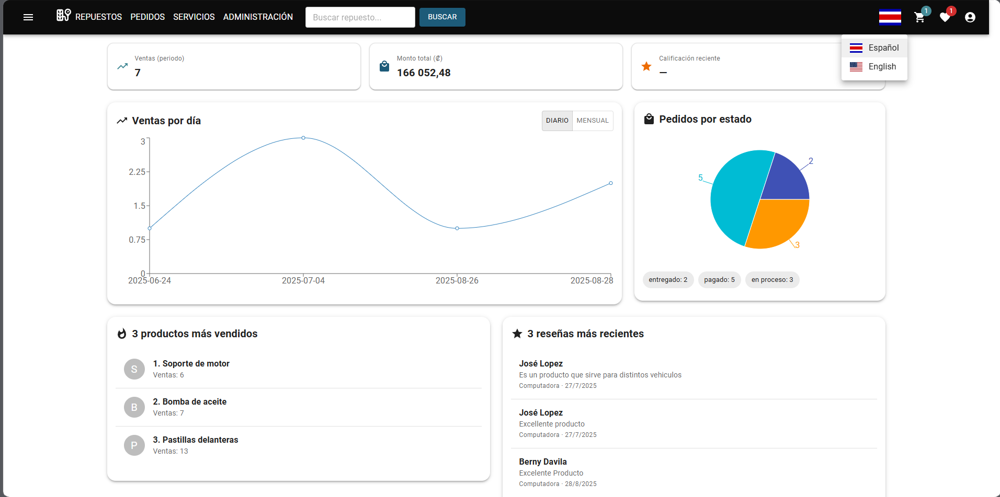
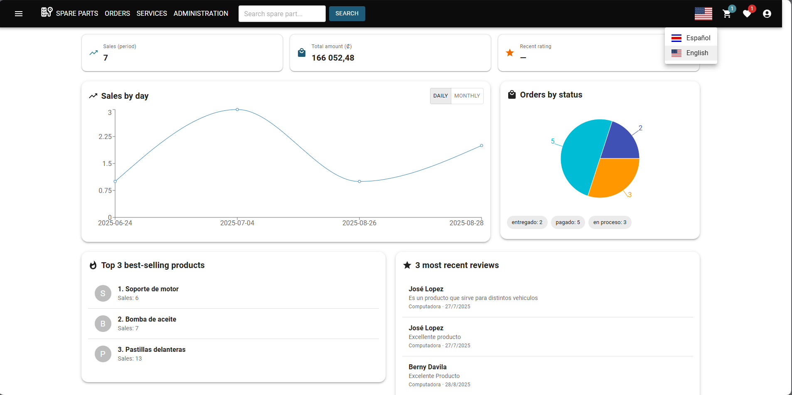
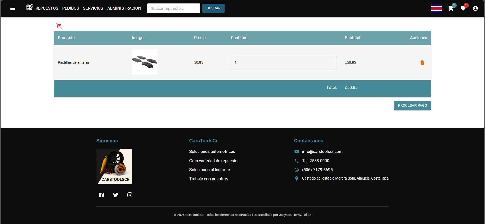
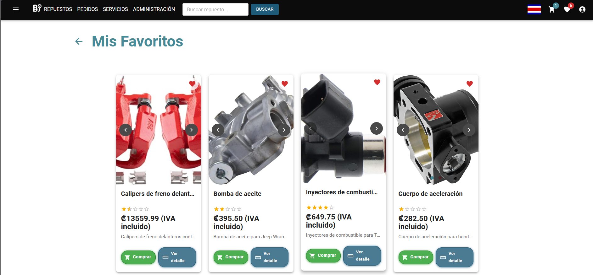
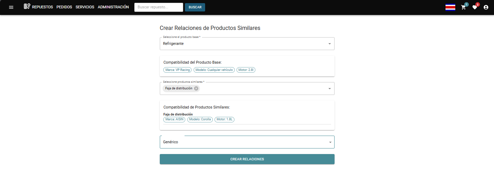

<div align="center">



# 🚗 CarsToolsCR

### Plataforma de comercio electrónico para la venta y gestión de repuestos automotrices

Sistema web Full Stack desarrollado para facilitar la compra, administración y seguimiento de repuestos automotrices mediante una plataforma moderna, segura y disponible en español e inglés.

<br>


</div>

---

#  Descripción

CarsToolsCR es una plataforma de comercio electrónico desarrollada como proyecto académico para facilitar la venta y administración de repuestos automotrices.

El sistema permite consultar productos, visualizar sus detalles, agregar artículos al carrito o a favoritos, registrar pedidos y publicar reseñas. También incluye un panel administrativo para gestionar productos, categorías, etiquetas, promociones, pedidos y demás información necesaria para el funcionamiento de la tienda.

La plataforma incorpora autenticación mediante JWT, traducción entre español e inglés, formularios con validaciones, gráficas administrativas y una base de datos MySQL.

---

#  Demostración del sistema

A continuación se presenta un recorrido por las principales funcionalidades de CarsToolsCR.

VIDEO_AQUI


https://github.com/user-attachments/assets/13879caf-4a9f-46ec-8a0e-1a4d03d4a0e9


---

#  Funcionalidades

- Registro e inicio de sesión de usuarios.
- Autenticación y protección de rutas mediante JWT.
- Catálogo de repuestos automotrices.
- Búsqueda de productos.
- Visualización detallada de productos.
- Carrusel de imágenes por producto.
- Gestión del carrito de compras.
- Gestión de productos favoritos.
- Creación y seguimiento de pedidos.
- Personalización de productos.
- Administración de categorías y etiquetas.
- Gestión de promociones y descuentos.
- Sistema de reseñas y valoraciones.
- Panel administrativo con indicadores.
- Gráficas de ventas y pedidos.
- Visualización de productos más vendidos.
- Visualización de reseñas recientes.
- Gestión de usuarios y roles.
- Cambio dinámico entre español e inglés.
- Formularios con validaciones.
- Interfaz adaptable a diferentes dispositivos.

---

#  Tecnologías utilizadas

| Frontend | Backend | Base de datos | Herramientas |
|----------|---------|---------------|--------------|
| React 18 | PHP | MySQL | Visual Studio Code |
| JavaScript | API REST | SQL | Git |
| HTML5 | Controladores PHP | Tablas relacionales | GitHub |
| CSS3 | Modelos PHP | Consultas SQL | npm |
| Material UI | JWT | | Composer |
| Styled Components | Middleware de autenticación | | Postman |
| React Router | | | Vite |
| Axios | | | |
| React Hook Form | | | |
| Yup | | | |
| Recharts | | | |
| i18next | | | |
| react-i18next | | | |

---

#  Arquitectura

```text
                       Usuario
                          │
                          ▼
                Frontend con React
                          │
                          ▼
                        Axios
                          │
                          ▼
                       API REST
                          │
                          ▼
                  Backend con PHP
                          │
          ┌───────────────┴───────────────┐
          ▼                               ▼
   Controladores                       Modelos
          │                               │
          └───────────────┬───────────────┘
                          ▼
                        MySQL
```

---

#  Vista previa del sistema

##  Panel administrativo

<p align="center">
  
</p>

El panel muestra indicadores de ventas, montos registrados, productos más vendidos, reseñas recientes y la distribución de pedidos según su estado.

---

##  Internacionalización

<p align="center">
  
</p>

CarsToolsCR incorpora soporte para español e inglés mediante `i18next` y `react-i18next`. El usuario puede cambiar el idioma directamente desde la barra de navegación.

---

##  Carrito de compras

<p align="center">
  
</p>

El carrito permite visualizar los productos seleccionados, modificar cantidades, eliminar artículos, consultar subtotales y continuar con el procesamiento del pedido.

---

##  Productos favoritos

<p align="center">
  
</p>

Los usuarios pueden guardar productos en su lista de favoritos, consultar sus características y agregarlos posteriormente al carrito de compras.

---


---

##  Gestión de productos similares

<p align="center">
  
</p>

El sistema permite crear relaciones entre productos similares tomando en cuenta su compatibilidad, marca, modelo y motor. Esta funcionalidad facilita la recomendación de repuestos relacionados y ayuda al usuario a encontrar alternativas compatibles con el producto seleccionado.


##  Inicio de sesión

<p align="center">
  
</p>

El sistema incorpora autenticación de usuarios, protección de contraseñas y control de acceso a las funcionalidades administrativas.

---

#  Características técnicas

- Arquitectura cliente-servidor.
- Frontend desarrollado con componentes reutilizables de React.
- Backend organizado mediante controladores, modelos, rutas y middleware.
- Comunicación entre frontend y backend mediante Axios y API REST.
- Autenticación mediante JSON Web Tokens.
- Protección y validación de credenciales.
- Formularios administrados con React Hook Form.
- Validaciones mediante Yup.
- Navegación con React Router.
- Gestión global del carrito mediante Context y reducers.
- Interfaz construida con Material UI y Styled Components.
- Gráficas administrativas desarrolladas con Recharts.
- Internacionalización con i18next y react-i18next.
- Gestión de imágenes múltiples para productos.
- Mensajes y notificaciones visuales.
- Base de datos relacional desarrollada en MySQL.

---

#  Mi participación

Participé como desarrollador **Full Stack** durante el desarrollo de CarsToolsCR, trabajando tanto en la interfaz como en la lógica del servidor y la integración con la base de datos.

Entre mis principales responsabilidades se encuentran:

- Desarrollo de interfaces con React y JavaScript.
- Creación y mantenimiento de componentes reutilizables.
- Implementación de estilos con Material UI y Styled Components.
- Desarrollo de formularios con React Hook Form.
- Implementación de validaciones mediante Yup.
- Desarrollo del backend utilizando PHP.
- Creación de controladores, modelos y rutas para la API REST.
- Integración entre React y PHP mediante Axios.
- Conexión y administración de la base de datos MySQL.
- Implementación de autenticación mediante JWT.
- Desarrollo de la gestión del carrito de compras.
- Desarrollo del módulo de favoritos.
- Desarrollo y mantenimiento del módulo de pedidos.
- Implementación de reseñas y valoraciones de productos.
- Desarrollo de promociones y descuentos.
- Gestión de productos, categorías y etiquetas.
- Implementación de productos personalizados.
- Desarrollo del panel administrativo y sus gráficas.
- Implementación del cambio de idioma entre español e inglés.
- Corrección de errores y optimización de funcionalidades.
- Pruebas de rutas, servicios y módulos del sistema.

---

# 📂 Estructura del proyecto

```text
CarsToolsCR
│
├── appShopTools
│   ├── src
│   │   ├── components
│   │   ├── context
│   │   ├── hooks
│   │   ├── reducers
│   │   ├── services
│   │   ├── themes
│   │   └── i18n.js
│   ├── package.json
│   └── vite.config.js
│
├── controllers
├── middleware
├── models
├── routes
├── database
├── uploads
├── composer.json
├── config.php
├── index.php
├── assets
│   ├── logocars.jpg
│   ├── dashboardCarsTools.png
│   ├── traduccion.png
│   ├── carrito.png
│   ├── favoritos.png
│   └── logincars.png
│
└── README.md
```

---

#  Instalación

## Requisitos

Antes de ejecutar el proyecto, se recomienda contar con:

- Node.js y npm.
- PHP.
- Composer.
- MySQL.
- Un servidor local como XAMPP.
- Visual Studio Code.

## Clonar el repositorio

```bash
git clone https://github.com/TU-USUARIO/CarsToolsCr.git

cd CarsToolsCr
```

## Configurar la base de datos

1. Crear una base de datos en MySQL.
2. Importar el archivo correspondiente desde la carpeta:

```text
database/
```

3. Configurar las credenciales de conexión en:

```text
config.php
```

## Instalar las dependencias del backend

```bash
composer install
```

## Instalar las dependencias del frontend

```bash
cd appShopTools

npm install
```

## Ejecutar el frontend

```bash
npm run dev
```

El frontend estará disponible normalmente en una dirección similar a:

```text
http://localhost:5173
```

El backend debe ejecutarse desde el servidor local configurado para PHP.

---

#  Estado del proyecto

🟢 **Proyecto finalizado**

Desarrollado como parte de la formación en Ingeniería de Software.

---

#  Autores

- Berny Dávila
- Jeeyson Martínez
- Felipe Cubillo


---

#  Licencia

Proyecto desarrollado con fines académicos y educativos.
